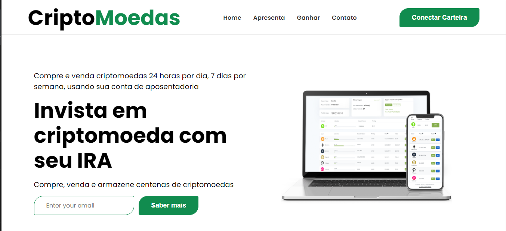

# Site de Criptomoedas

Este Projeto é uma de pagina  visualização de crypo moeda onde os valores são capturados de uma api com um sistema de login e cadastro 

# imagem do Projeto 
 

  

## Instalação e Rodar o Projeto

## FRONTEND

1. `$ cd site`
2. `$ npm install`
3. `$ npm start`

## Site do Projeto

https://site-criptonoedas.vercel.app/

## Repositorio do Projeto

https://github.com/JacquelineCasali/Site-Criptonoedas.git

## Instalação

## FRONTEND

1. `$ npm install`
2. `$ npm start`

## BackEnd

1. `$ cd server`
2. `$ npm run start`

## Descrição

--API fake - utilizando o json-server
-- APi para captura de valores

## Bibliotecas Usadas

## FRONTEND

-- `Axios`
-- `React.js`
-- `Bootstrap`

 ## Back-end
-- `Api - https://www.coingecko.com/`
-- `json-server`